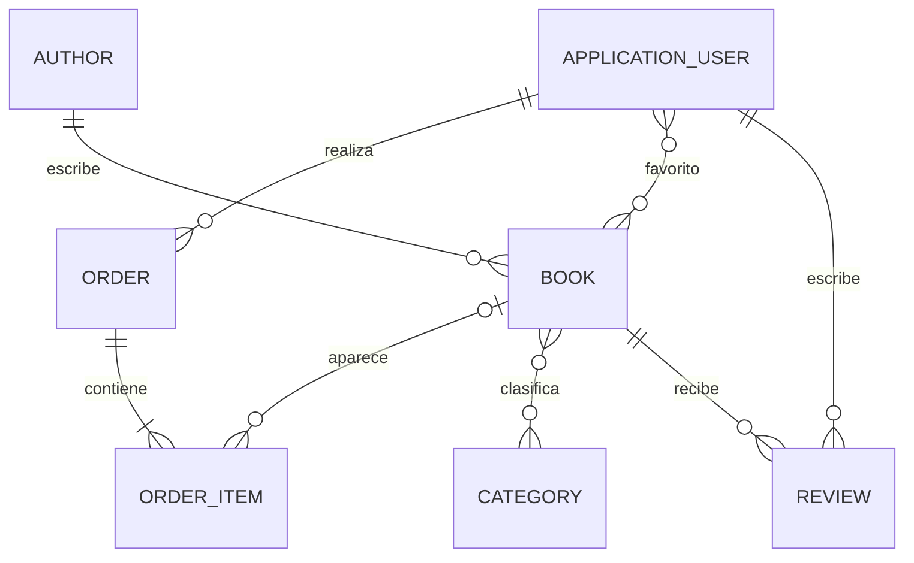

# Guía de lectura del código

Esta guía y los comentarios cortos del código están pensados para la primera lectura
de ASP.NET Core MVC. No hace falta dominar patrones de diseño para seguir el proyecto.

## 1. Asociaciones del modelo



| Asociación | Propiedades C# | Idea principal |
| --- | --- | --- |
| Autor 1:N Libro | `Book.AuthorId`, `Book.Author`, `Author.Books` | Cada libro tiene un autor. |
| Libro N:M Categoría | `Book.Categories`, `Category.Books` | EF Core crea `BookCategories`. |
| Usuario N:M Libro favorito | `FavoriteBooks`, `FavoriteUsers` | No necesita entidad propia en este ejemplo. |
| Usuario 1:N Reseña | `Review.UserId`, `Review.User` | El ID se obtiene de la cookie, nunca del formulario. |
| Usuario 1:N Pedido | `Order.UserId`, `Order.User` | El histórico pertenece a la cuenta. |
| Pedido 1:N Línea | `Order.Items`, `OrderItem.OrderId` | Una compra puede contener varios libros. |

Las entidades están en `Models/` y la configuración de claves, longitudes y borrados
en `Data/ApplicationDbContext.cs`. Las migraciones de `Data/Migrations/` las genera
EF Core; se versionan, pero no se escriben a mano en clase.

## 2. Recorrido de un CRUD

Un listado de libros sigue este recorrido:

```text
GET /Books
   ↓
BooksController.Index
   ↓ llama a un método claro
BookService.Search → ApplicationDbContext → SQLite
   ↓
BookListViewModel → Views/Books/Index.cshtml
```

`BookService` se conserva porque reúne filtros, relación N:M, favoritos y portadas.
Para un CRUD muy sencillo un controlador puede inyectar `ApplicationDbContext`
directamente; EF Core ya proporciona repositorio y unidad de trabajo. No se crea una
interfaz ni una capa `Repository` si solo existe una implementación.

Un alta aplica este flujo:

```text
Formulario Razor → POST del controller → ModelState
                 → servicio o DbContext → SaveChanges()
                 → RedirectToAction()
```

La redirección posterior al POST evita reenviar el formulario al actualizar la página:
es el patrón PRG (Post/Redirect/Get).

## 3. Cómo leer una acción MVC

`IActionResult` no es un objeto especial de negocio: es simplemente el tipo de
respuesta de una acción MVC. Permite que una misma acción exprese con claridad las
respuestas HTTP habituales:

```csharp
if (book is null)
{
    return NotFound();       // HTTP 404
}

return View(book);          // Renderiza Views/Books/Details.cshtml
// return RedirectToAction(nameof(Index)); // Redirige después de un POST
```

La información de cada pantalla se entrega mediante un `ViewModel` tipado, igual que
un DTO de respuesta. `ViewData["Title"]` se reserva únicamente para el título que
consume el layout común; no se usa como un `Map<String, Object>` para los datos de la
página. `TempData` es el mensaje flash de la siguiente petición, por ejemplo «Libro
creado correctamente» tras una redirección.

Las acciones con `[Authorize]` ya tienen una cookie válida. Por ello usan
`User.GetRequiredUserId()`: es un nombre legible para extraer de los *claims* el ID de
la cuenta actual, equivalente al principal autenticado que recibirías en un
controlador de Spring Security.

## 4. `Models` y `ViewModels`

Un `ViewModel` es equivalente a un DTO de Spring Boot, pero suele organizarse por
página. No es una capa complicada:

- `Models/Book.cs` representa una fila persistente y sus relaciones.
- `ViewModels/Books/BookFormViewModel.cs` representa los campos que llegan del
  formulario: portada (`IFormFile`) e IDs de categorías.
- `BookFormViewModel.ToBook()` crea la entidad; `BookService` busca después el autor y
  las categorías reales con esas IDs.

Esto evita que un formulario pueda enviar propiedades que no debería cambiar, como
colecciones completas de usuarios o el propietario de una reseña.

## 5. Carrito y pedido

`CartService` guarda en la sesión algo parecido a:

```json
{ "3": 2, "7": 1 }
```

Son IDs y cantidades, no libros ni precios. `OrderService.Checkout` consulta de nuevo
SQLite, verifica que los libros siguen disponibles y copia título y precio a
`OrderItem`. Así un pedido histórico no cambia aunque más tarde cambie el catálogo.

## 6. Usuarios con Identity

`ApplicationUser` hereda de `IdentityUser`; Identity proporciona hash de contraseña,
cookies, bloqueo temporal y roles. La aplicación añade nombre visible, avatar, estado
y fecha de alta.

- `[Authorize]` exige una sesión iniciada.
- `[Authorize(Roles = RoleNames.Admin)]` restringe el panel de administración.
- `User.GetRequiredUserId()` obtiene el ID de la cuenta actual desde los *claims*.
- `AccountController`, `ProfileController` y `UsersController` forman la base común
  de todos los grupos.

La API de Identity es asíncrona por diseño. Es la única excepción deliberada del
proyecto: registro, login, contraseña y roles usan `await`; las consultas y el CRUD
del dominio utilizan métodos normales y `SaveChanges()`.

## 7. Añadir una entidad nueva

Para `Product`, `Movie` o `Dish`:

1. Crear la entidad en `Models/` con validaciones y navegaciones.
2. Añadir `DbSet` y relación en `ApplicationDbContext`.
3. Crear la migración: `dotnet ef migrations add AddProducts`.
4. Crear su `ViewModel` de formulario.
5. Crear el controlador y las cinco vistas CRUD.
6. Usar `ApplicationDbContext` directamente o una clase concreta pequeña si hay una
   regla real (por ejemplo, una compra o una subida de imagen).
7. Añadir datos demo a `DbInitializer` y comprobar la pantalla completa.
8. Hacer un commit pequeño con ese slice vertical.

La primera entidad puede ser muy sencilla. Las asociaciones se añaden después, una a
una, para que cada alumno entienda qué tabla y qué pantalla está cambiando.

## 8. Test unitario y CI

`tests/BibliotecaAspNet.Tests` es un proyecto xUnit separado. Su primer test cubre
`ColorContrast`, una regla pura que no necesita arrancar MVC, Identity ni SQLite. Es
el tipo de test unitario más fácil de entender: entrada, llamada y resultado esperado.

```bash
dotnet test BibliotecaAspNet.slnx
```

`.github/workflows/build-and-test.yml` ejecuta exactamente la misma comprobación en
GitHub Actions para cada *push* a `main` y cada *pull request*. El CI no sustituye una
revisión visual de la aplicación, pero evita aceptar cambios que no restauran,
compilan o superan sus tests.

## 9. Orden recomendado de lectura

1. `Models/Book.cs`, `Models/Author.cs`, `Models/Category.cs`.
2. `Data/ApplicationDbContext.cs`.
3. `ViewModels/Books/BookFormViewModel.cs`.
4. `Services/BookService.cs`.
5. `Controllers/BooksController.cs`.
6. `Views/Books/`.
7. `Models/ApplicationUser.cs` y los controladores de cuenta.
