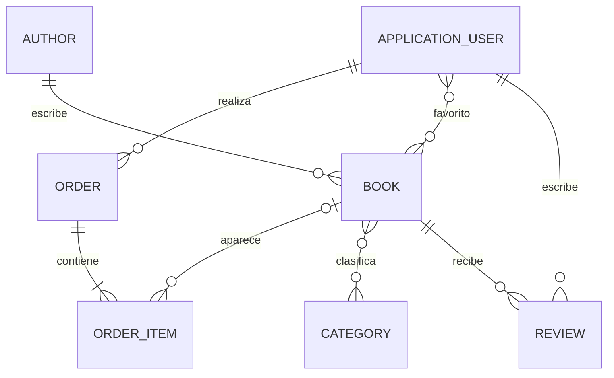

# Guía de lectura del código

Esta guía acompaña a los comentarios XML del código. La intención es que una persona
que empieza con ASP.NET pueda seguir una petición completa y después repetir el mismo
recorrido para una entidad propia.

## 1. El modelo de entidades



| Asociación | Cómo se representa en C# | Tabla o FK | Idea importante |
| --- | --- | --- | --- |
| `Author` → `Book` | `Book.AuthorId` + `Book.Author` y `Author.Books` | `Books.AuthorId` | Un autor tiene muchos libros; cada libro tiene un autor. |
| `Book` ↔ `Category` | `Book.Categories` + `Category.Books` | `BookCategories` | Es N:M; EF Core crea la tabla intermedia. |
| `ApplicationUser` ↔ `Book` | `FavoriteBooks` + `FavoriteUsers` | `UserFavorites` | Un favorito no necesita una entidad propia en este ejemplo. |
| `ApplicationUser` → `Review` | `Review.UserId` + `Review.User` | `Reviews.UserId` | El usuario se obtiene de la cookie, no del formulario. |
| `Book` → `Review` | `Review.BookId` + `Review.Book` | `Reviews.BookId` | Un libro puede tener muchas reseñas. |
| `ApplicationUser` → `Order` | `Order.UserId` + `Order.User` | `Orders.UserId` | El histórico de compras pertenece a una cuenta. |
| `Order` → `OrderItem` | `OrderItem.OrderId` + `Order.Items` | `OrderItems.OrderId` | Un pedido agrupa sus líneas. |
| `OrderItem` → `Book` | `OrderItem.BookId` + `OrderItem.Book` | `OrderItems.BookId` | Es opcional para conservar el pedido si se borra el libro. |

Los comentarios de las clases de `Models/` explican la misma información junto a cada
propiedad. La configuración técnica está en
[`Data/ApplicationDbContext.cs`](../Data/ApplicationDbContext.cs), dentro de
`OnModelCreating`.

`Author.PhotoFileName` y `Book.CoverImageFileName` no guardan una imagen dentro de la
base de datos: guardan el nombre seguro de un archivo público. `ImageStorage` valida la
subida, genera el nombre y devuelve la URL que consume Razor. Los archivos de demo se
encuentran en `wwwroot/uploads/author-photos` y `wwwroot/uploads/book-covers`; los
archivos que se suban desde la aplicación siguen ignorados por Git.

### Por qué `OrderItem` guarda una copia del título y del precio

El precio del catálogo puede cambiar y un libro puede dejar de existir. Por eso una
línea de pedido guarda `BookTitle` y `UnitPrice` en el momento de la compra. `BookId`
queda como referencia opcional para enlazar con el catálogo cuando todavía existe.

## 2. El recorrido de una pantalla CRUD

Una petición de listado sigue este camino:

```text
Navegador
   ↓ GET /Books
BooksController.Index
   ↓
IBookService / BookService
   ↓
IBookRepository / BookRepository
   ↓ LINQ traducido a SQL
ApplicationDbContext → SQLite
   ↑
BookListViewModel → Views/Books/Index.cshtml
```

- El `Controller` conoce HTTP, rutas, usuario autenticado y qué vista devolver.
- El `Service` coordina el caso de uso y aplica reglas como disponibilidad o permisos.
- El `Repository` prepara consultas EF Core (`Where`, `Include`, `OrderBy`, etc.).
- El `ApplicationDbContext` representa la sesión de EF Core y sus tablas.
- El `ViewModel` contiene exactamente los datos que una página o formulario necesita.
- La vista Razor (`.cshtml`) genera el HTML con Bootstrap.

En un alta, el recorrido es el mismo en sentido inverso:

```text
Formulario Razor → POST Controller → validación ModelState
                 → Service → Repository.Add → SaveChanges
                 → RedirectToAction → GET de la página final
```

El `RedirectToAction` después de un POST aplica el patrón PRG (Post/Redirect/Get):
al refrescar el navegador no se vuelve a enviar el formulario.

## 3. `Models` frente a `ViewModels`

Sí: los `ViewModels` cumplen un papel parecido a los DTO de Spring Boot, pero están
organizados por pantalla o caso de uso:

- `Models/Book.cs` es la entidad persistente y contiene sus asociaciones.
- `ViewModels/Books/BookFormViewModel.cs` contiene los campos del formulario, el
  `IFormFile` de la portada y los IDs seleccionados de categorías.
- `ViewModels/Authors/AuthorFormViewModel.cs` contiene la foto opcional y la casilla
  para eliminar la fotografía actual.
- `BookFormViewModel.ToBook()` hace el mapeo de entrada; el servicio resuelve después
  las entidades `Author` y `Category` reales desde la base de datos.

Esta separación evita enlazar directamente colecciones y campos sensibles de una
entidad cuando llega una petición HTTP. En una página sencilla se podría reutilizar
una entidad, pero para formularios con archivos, IDs o datos de pantalla el ViewModel
resulta más claro y seguro.

## 4. Qué significa `Async`

Los nombres `SearchAsync`, `SaveChangesAsync` o `SaveAsync` indican que el método
realiza una operación de entrada/salida: base de datos, disco o Identity. `await`
espera el resultado sin bloquear un hilo del servidor mientras SQLite o el sistema de
archivos trabajan.

No es un patrón de diseño ni una regla de negocio. Para leer el código se puede pensar
en `await` como “espera este resultado y continúa aquí”. El `CancellationToken` permite
cancelar una consulta si el navegador abandona la petición.

## 5. La base común de usuarios

`ApplicationUser` hereda de `IdentityUser`, que ya aporta usuario, email, hash de
contraseña, bloqueo y roles. La aplicación añade nombre visible, avatar, estado y fecha
de alta.

- `AccountController`: registro, login y logout.
- `ProfileController`: perfil, avatar y cambio de contraseña.
- `UsersController`: CRUD administrativo de usuarios.
- `[Authorize]`: exige una sesión iniciada.
- `[Authorize(Roles = RoleNames.Admin)]`: exige el rol administrador.
- `User.FindFirstValue(ClaimTypes.NameIdentifier)`: obtiene el ID de la cuenta actual.
- `Font Awesome` se carga desde `wwwroot/lib` y `_Layout.cshtml` usa `data-bs-theme`
  para que el botón de tema cambie entre claro y oscuro sin duplicar vistas.

Cuando una entidad de un proyecto de grupo pertenece a un usuario, se añade el mismo
patrón:

```csharp
public string UserId { get; set; } = string.Empty;
public ApplicationUser User { get; set; } = null!;
```

El `UserId` se rellena en el servidor a partir de Claims. No se acepta un `UserId`
enviado por el formulario porque otro usuario podría intentar suplantar al propietario.

## 6. Cómo añadir una entidad nueva en clase

Para crear, por ejemplo, `Product`, `Movie` o `Dish`, se puede seguir este checklist:

1. Crear la entidad en `Models/` con validaciones y navegaciones.
2. Añadir su `DbSet` y configurar relaciones en `ApplicationDbContext`.
3. Crear una migración: `dotnet ef migrations add AddProducts`.
4. Crear el repositorio con las consultas que el listado y el detalle necesiten.
5. Crear el servicio con las reglas de negocio.
6. Crear ViewModels de formulario y listado.
7. Crear el controlador con `Index`, `Details`, `Create`, `Edit` y `Delete`.
8. Crear las vistas Razor y añadir navegación en `_Layout.cshtml`.
9. Añadir datos demo idempotentes en `DbInitializer`.
10. Comprobar el recorrido completo y hacer un commit pequeño.

La regla didáctica es completar primero un slice vertical: entidad, persistencia,
servicio, controlador y UI. Después se añade la siguiente asociación.

## 7. Orden recomendado para leer este repositorio

1. `Models/Book.cs`, `Models/Author.cs` y `Models/Category.cs`.
2. `Data/ApplicationDbContext.cs` para ver las tablas y relaciones.
3. `Repositories/BookRepository.cs` para ver consultas LINQ.
4. `Services/BookService.cs` para ver el caso de uso y sus reglas.
5. `ViewModels/Books/BookFormViewModel.cs`.
6. `Controllers/BooksController.cs`.
7. `Views/Books/` para ver el HTML Razor y Bootstrap.
8. `Models/ApplicationUser.cs` y el bloque de Identity para la base común.

Los archivos de `Data/Migrations/` son generados por EF Core. Se versionan en Git para
que cada equipo pueda recrear el esquema, pero no se editan manualmente.
